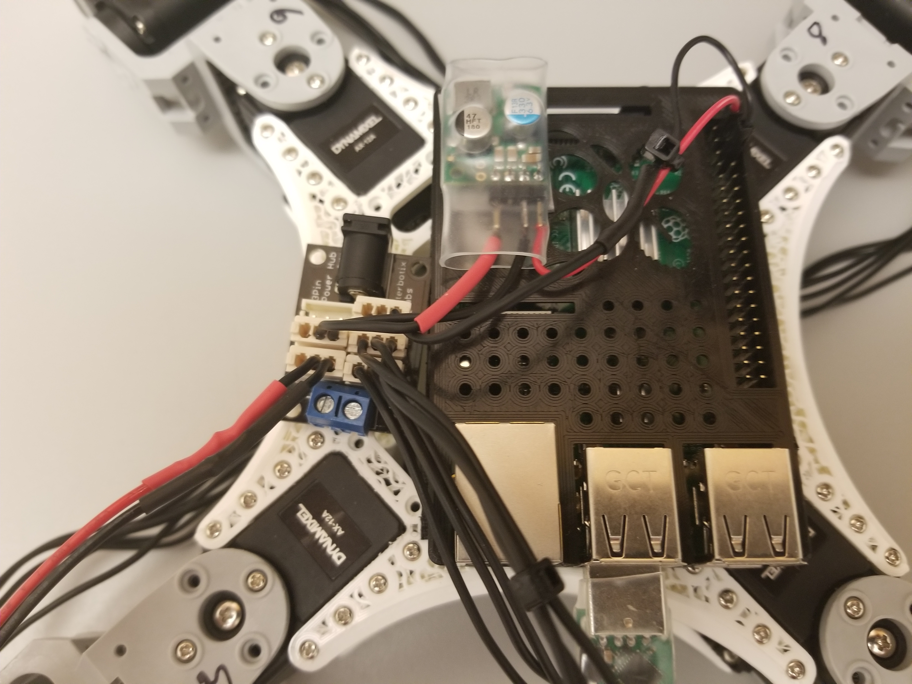

# Real Ant BT

## Motivation

As fans of the new
<a href="https://www.inceptivemind.com/open-source-low-cost-realant-robot-learns-reinforcement-learning/16926/">RealAnt</a>
reinforcement learning platform, we were looking for a way to control the RealAnt wirelessly.  Thanks to the built-in
Bluetooth chip on the Raspberry Pi, this proved to be straightforward.  

## Parts

Assuming you have some experience with soldering, heat-shrink tubing, and battery-safety issues, the parts list
and assembly images below should be sufficient to set up your RealAnt:

1. [RealAnt](https://github.com/OteRobotics/realant#get-your-realant)

2. [RaspberryPi](https://www.amazon.com/Raspberry-Model-2019-Quad-Bluetooth/dp/B07TC2BK1X)

3. [Six-port power hub](https://www.trossenrobotics.com/6-port-ax-mx-power-hub)

3. [U2D2 USB adapter](https://www.robotis.us/u2d2/)  (The smaller USB adapter shown in the image above is no longer available.)

4. [5V, 3.2A step-down voltage regulator](https://www.pololu.com/product/3782)

5. [11.1V Lipo battery with JST connector](https://www.rcplanet.com/protek-rc-3s-high-power-lipo-20c-battery-pack-11.1v-1100mah-blade-sr-ptk-5179/p177000)

6. [JST female battery connectors](https://www.amazon.com/gp/product/B06XRBKSY2)

7. [Dynamixel three-pin cables](https://www.trossenrobotics.com/p/200mm-3-pin-dynamixel-compatible-cables-10-pack)

8. [Female jumper wires](https://www.adafruit.com/product/794)

9. [Heat-shrink tubing for wires](https://www.amazon.com/gp/product/B00Q7V49RQ)

10. [Heat-shrink tubing for voltage regulator](https://www.amazon.com/dp/B075ZW5WXW)

11. [Velcro strips](https://www.amazon.com/Adhesive-Industrial-Strength-Strong-Strips/dp/B097TWHBTG/)

12. [Raspberry Pi case exposing pin headers](https://www.thingiverse.com/thing:559858)

## Assembly

Battery connector (lower-right) supplies power to volate regulator (upper-right)

## Software

## Future work

Currently our Bluetooth connection is one-way, sending command to the RealAnt but not retrieving any
telemetry data (postion, orientation, etc.)  In future work we plan to add this capability.

## Credits

A big thanks to the &ldquo;Thing 1&rdquo; team from the spring 2022 W&L
[CSCI 316](https://simondlevy.academic.wlu.edu/home/csci-316-advanced-topics-in-robotics/)
course: [Yoseph Tamene](https://github.com/tameney22), Dan Nguyen, and Haochen Tu. We are
also grateful to W&L IQ Center Director Dave Pfaff for help with assembly and testing.

