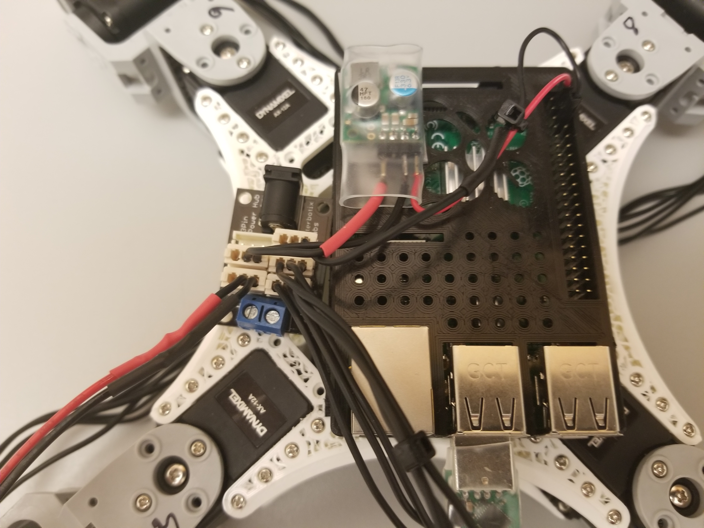
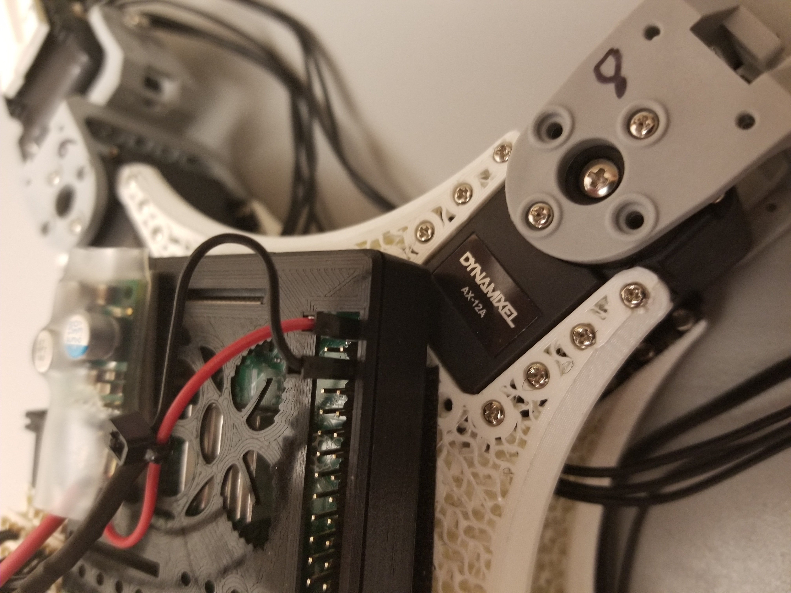
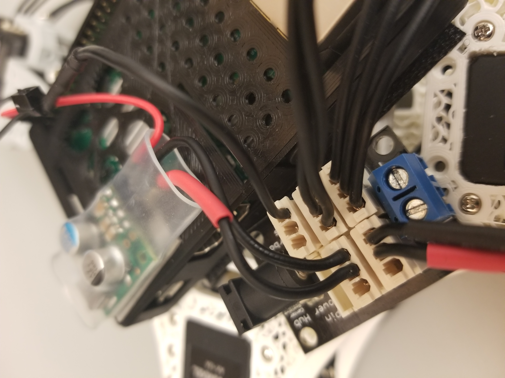
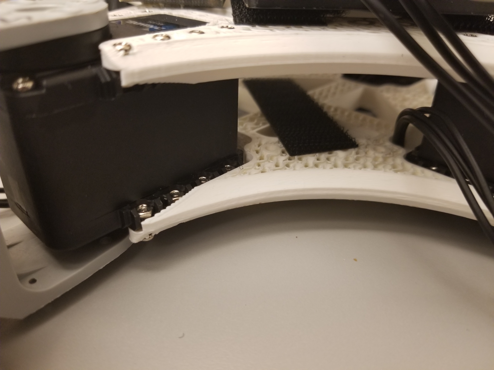
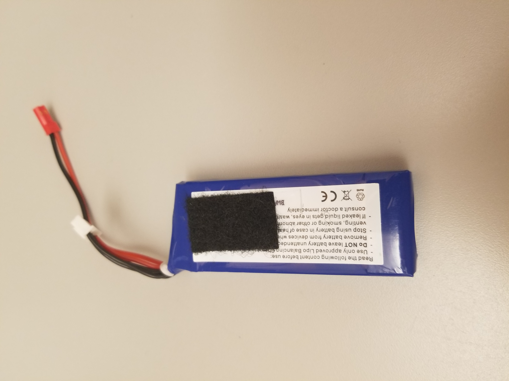

# Real Ant BT

<a href="https://www.youtube.com/watch?v=fSu-80Ofek4"></a>

## Motivation

As fans of the new
<a href="https://www.inceptivemind.com/open-source-low-cost-realant-robot-learns-reinforcement-learning/16926/">RealAnt</a>
reinforcement learning platform, we were looking for a way to control the RealAnt wirelessly.  Thanks to the built-in
Bluetooth chip on the Raspberry Pi, this proved to be straightforward.  

## Parts

Assuming you have some experience with soldering, heat-shrink tubing, and battery-safety issues, the parts list
and assembly images below should be sufficient to set up your RealAnt:

1. [RealAnt](https://github.com/OteRobotics/realant#get-your-realant)

2. [RaspberryPi](https://www.amazon.com/Raspberry-Model-2019-Quad-Bluetooth/dp/B07TC2BK1X)

3. [Six-port power hub](https://www.trossenrobotics.com/6-port-ax-mx-power-hub)

3. [U2D2 USB adapter](https://www.robotis.us/u2d2/)  (The smaller USB adapter shown in the image above is no longer available.)

4. [5V, 3.2A step-down voltage regulator](https://www.pololu.com/product/3782)

5. [11.1V Lipo battery with JST connector](https://www.rcplanet.com/protek-rc-3s-high-power-lipo-20c-battery-pack-11.1v-1100mah-blade-sr-ptk-5179/p177000)

6. [JST female battery connectors](https://www.amazon.com/gp/product/B06XRBKSY2)

7. [Dynamixel three-pin cables](https://www.trossenrobotics.com/p/200mm-3-pin-dynamixel-compatible-cables-10-pack)

8. [Female jumper wires](https://www.adafruit.com/product/794)

9. [Heat-shrink tubing for wires](https://www.amazon.com/gp/product/B00Q7V49RQ)

10. [Heat-shrink tubing for voltage regulator](https://www.amazon.com/dp/B075ZW5WXW)

11. [Velcro strips](https://www.amazon.com/Adhesive-Industrial-Strength-Strong-Strips/dp/B097TWHBTG/)

12. [Small cable ties](https://www.amazon.com/gp/product/B0002GX1XA/)

13. [Raspberry Pi case exposing pin headers](https://www.thingiverse.com/thing:559858)

14. [Bluetooth adapter](https://www.amazon.com/D-Link-DBT-120-Wireless-Bluetooth-Adapter/dp/B00006B7DB) for
your computer if it doesn't have one (most laptops do, and most desktops do not).

## Assembly



Battery connector (lower left) supplies power to voltage regulator (top
left),<br>which supplies 5V to Raspberry Pi GPIO header (top right).

<br><br><br>



Details of Raspberry Pi power connection (see
[pinout](https://www.etechnophiles.com/wp-content/uploads/2021/01/R-Pi-4-GPIO-Pinout-1-768x572.jpg))

<br><br><br>



Details of six-port power hub.  Note the single ground wire for the Raspberry Pi.

<br><br><br>



A velcro strip helps keep the battery in place.

<br><br><br>



A shorter velcro strip on the battery

## Software

Run the following commands on your Raspberry Pi:

```
git clone https://github.com/ROBOTIS-GIT/DynamixelSDK
cd DynamixelSDK/python/
sudo pip3 install -e .
cd
git clone https://github.com/simondlevy/dynamixel-ax12
cd dynamixel-ax12/
sudo pip3 install -e .
cd
git clone https://github.com/simondlevy/RealAntBT
cd RealAntBT
sudo pip3 install -e .
```

To make sure that your RaspberryPi starts the running the Bluetooth server program on
startup, you'll want to insert the following line into its <b>/etc/rc.local</b> file:
```
/usr/bin/python /home/pi/RealAntBT/bluetooth/server.py --delay 5 &
```

If you haven't already modified your <b>/etc/rc.local</b>, you can simply replace it with
the one [provided](https://github.com/simondlevy/RealAntBT/blob/master/rc.local) in this repository.

Finally, you'll want to run the command ```hcitool dev``` on your Raspberry Pi to determine the 
MAC address of its Bluetooth chip.

If you've assembled and installed everything correctly, you should be able to shutdown your Raspberry
Pi, power it up with the battery, wait a few seconds for it to boot up, and run the 
[bluetooth/walk_client.py](https://github.com/simondlevy/RealAntBT/blob/master/bluetooth/walk_client.py)
script on your desktop or laptop computer to make the RealAnt walk for five seconds.

## Future work

Currently our Bluetooth connection is one-way, sending command to the RealAnt but not retrieving any
telemetry data (postion, orientation, etc.)  In future work we plan to add this capability. 

As we have not measured the current draw on our hardware setup, it would also be useful to have
the Raspberry Pi report the current battery voltage, so a fresh battery can be swapped in before
the onboard battery runs down.

## Credits

A big thanks to the &ldquo;Thing 1&rdquo; team from the spring 2022 W&L
[CSCI 316](https://simondlevy.academic.wlu.edu/home/csci-316-advanced-topics-in-robotics/)
course: [Yoseph Tamene](https://github.com/tameney22), Dan Nguyen, and Haochen Tu. We are
also grateful to W&L IQ Center Director [Dave Pfaff](https://columns.wlu.edu/meet-a-general-dave-pfaff/)
for help with assembly and testing.


